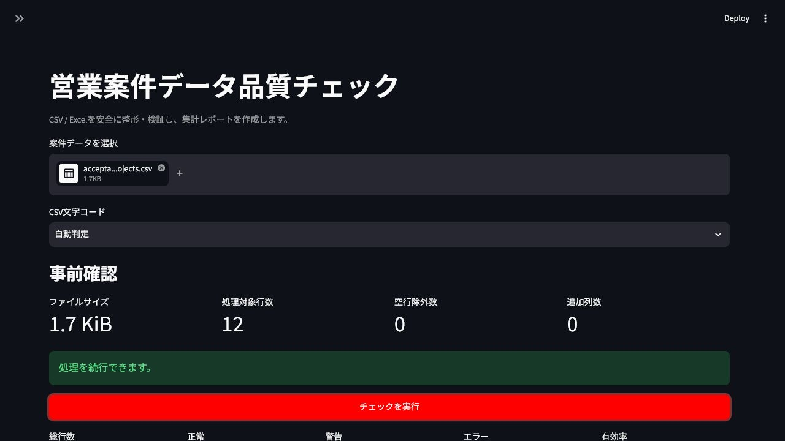
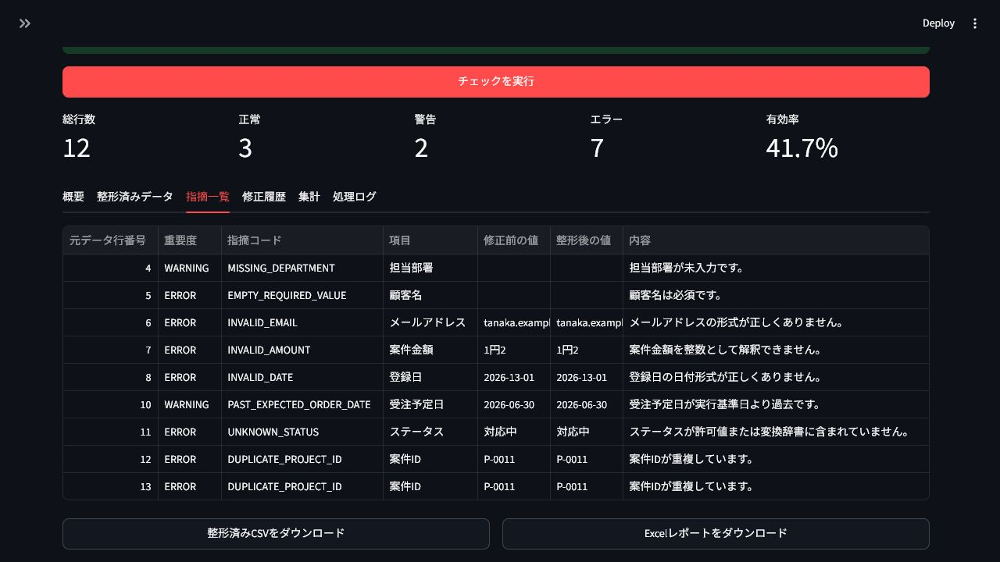

# 営業案件データ品質チェックツール

[](https://github.com/kabe230/sales-data-quality-tool/actions/workflows/ci.yml)


[](LICENSE)

CSV／Excelで管理される営業案件データを、ブラウザ上で安全に整形・検証・集計する
Streamlitアプリです。元ファイルを変更せず、修正履歴と指摘根拠を残しながら、
集計に利用できる行だけをレポートへ反映します。

**[公開デモを開く](https://kabe230-sales-data-quality-tool.streamlit.app/)**

## ドキュメント

- [応募書類・面接用の紹介ガイド](PORTFOLIO_GUIDE.md)
- [製品仕様](SPEC.md)
- [受入基準](ACCEPTANCE_CRITERIA.md)
- [固定12件のサンプルデータ仕様](SAMPLE_DATA_SPEC.md)
- [実装計画・進捗](IMPLEMENTATION_PLAN.md)
- [当初の開発指示書](仕様書.md)

## 画面イメージ

アップロード後に、ファイルサイズ、処理行数、空行、追加列を事前確認できます。



チェック結果は行判定の件数とともに表示し、指摘コード、対象項目、修正前後の値、
理由を一覧で追跡できます。



## 主な機能

- UTF-8・Shift-JISのCSVと `.xlsx` の読込
- 案件ID、メール、金額、日付、ステータスの安全な自動整形
- 必須、形式、重複、金額上限、日付前後関係などの検証
- `NORMAL`／`WARNING`／`ERROR` の行判定と修正履歴
- ERROR行を除外したステータス・顧客・部署・月別集計
- UTF-8 BOM付きCSVと9シートExcelレポート
- CSV／Excel数式インジェクション対策
- アップロードデータを永続保存しないメモリ内処理

## 起動方法

Python 3.12以上を用意し、プロジェクト直下で実行します。

```bash
python -m venv .venv
# Windows
.venv\Scripts\activate
python -m pip install -e ".[dev]"
streamlit run app.py
```

画面で `sample_data/valid_projects.csv` または
`sample_data/invalid_projects.csv` を選ぶと、すぐに動作を確認できます。

## 入力フォーマット

次の11列が必要です。列順は任意で、仕様外の列も維持されます。

| 列名 | 内容 |
|---|---|
| 案件ID | `P-0001` など。英大文字から始まる50文字以内 |
| 顧客名／担当者名／案件名 | 必須の文字列 |
| メールアドレス | 簡易業務形式で検証 |
| 案件金額 | 円単位の整数。通貨記号・3桁カンマも整形可能 |
| ステータス | 新規、商談中、見積提出、受注、失注、保留 |
| 担当部署 | 値は任意。未入力は警告 |
| 登録日／受注予定日 | `YYYY-MM-DD` など |
| 備考 | 任意 |

最大ファイルサイズは10 MiB、最大データ行数は10,000行です。

## 判定と集計

- ERROR: 必須欠落、形式不正、重複IDなど。集計対象外
- WARNING: 担当部署未入力、過去の受注予定日など。集計対象
- NORMAL: 指摘なし。集計対象

自動整形は結果が一意になる変換だけを行い、変化したセルには修正履歴を残します。
推測を要するデータは変更しません。

## 設計

```text
app.py
  ├─ loader.py
  ├─ service.py
  │   └─ processing/
  │       ├─ cleaner.py
  │       ├─ validator.py
  │       └─ aggregator.py
  └─ exporter.py
```

業務ロジックはStreamlitから分離しているため、単体テストや別UIから再利用できます。
入力DataFrameはコピーして処理し、ファイル名はベース名へ安全化します。

## 品質チェック

```bash
ruff check .
ruff format --check .
pytest --cov=src/sales_data_quality --cov-report=term-missing --cov-fail-under=80
```

同じコマンドをGitHub Actionsでも実行します。

現在の検証結果:

- 固定12件の受入テストを含む34テストが成功
- テストカバレッジ91.55%
- 10,000行をカバレッジ計測下でも15秒以内で処理
- `ruff check .` と `ruff format --check .` が成功

## 制約

- 対応形式は `.csv` と `.xlsx` のみです。
- メール検証は完全なRFC準拠ではなく、業務向けの簡易ルールです。
- サーバーやデータベースへの保存、ユーザー認証は含みません。
